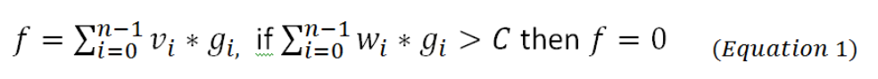
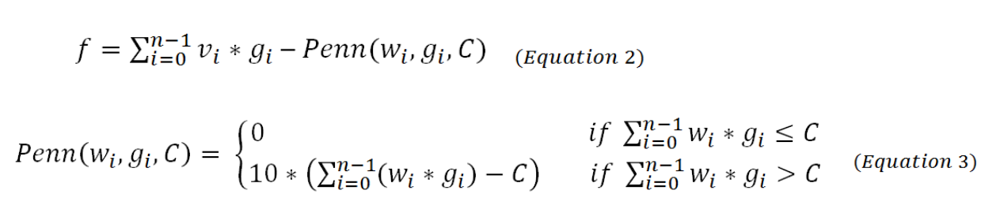

# mutation-rates-genetic-algorithm

<h4>Purpose of Repository:</h4>
This repository is the location of the code for Iris Shaker-Check’s Senior Thesis on mutation rates in Genetic Algorithms. 

<h4>What is a Genetic Algorithm:</h4>
Genetic Algorithms (GA) are a type of Evolutionary Algorithm (EA), which is a form of machine learning. It is inspired by the biological evolutionary process, specifically, the concept of survival of the fittest. Survival of the fittest is the concept that there are some individuals in a species that are more adapted to their environments than others. The better adapted an individual is the more likely it will be able survive long enough to reproduce and create offspring. The more offspring an individual produces the more its traits are represented in the population. Overtime, this leads to a population that is made up of individuals that are on average better adapted to their environment. 

For GAs each individual in the population is a solution. The population goes through the process of parent selection, crossover, and mutation to create a new generation of individuals. In this GA the tournament method is used for parent selection. In the tournament method a random subset of individuals is pulled from the population. Each individual in the subset has its fitness evaluated. The individual with the highest fitness is then selected. This process allows for solutions with a higher fitness to be selected, while maintaining genetic diversity among solutions. When the two parent individuals have been selected, crossover is performed. Crossover is achieved by splitting both collections of parent solutions in one or more places. These sections of the solutions are recombined to create a new individual(s). Mutations are the “random” changing of a gene. In a GA where the solution is encoded in 0’s and 1’s, a mutation would be switching a 1 to a 0 or vice versa. 

Over many generations, the goal is to find the optimal solution to a problem. The number of generations is set in the geneticAlgorithm class. GAs are most helpful for problems that require solutions that maximize or minimize a value. 

For more information on GAs and terminology see: <a href="https://www.tutorialspoint.com/genetic_algorithms/index.htm"> https://www.tutorialspoint.com/genetic_algorithms/index.htm </a>

<h4>The KnapSack Problem:</h4>
The Knapsack Problem is where there is a knapsack with a weight limit. There are also items that have a weight and a value. The weight of all the items exceeds the weight limit of the knapsack. The goal of the Knapsack Problem is to find the set of items that maximizes the value in the knapsack, but does not exceed the weight of the knapsack. 

This research specifically focuses on GA with the Knapsack Problem, since it is an optimization problem which Genetic Algorithms are particularly adept at solving. The Knapsack Problem is also an NP-Hard problem which makes it a difficult problem to solve efficiently. Therefore, making a Genetic Algorithm that can solve problems more accurately will give a better way of solving the Knapsack Problem and other NP-Hard problems efficiently. This research tests self-adapting mutation rates, gene specific self-adapting mutation rates, and static mutation rates.

<h4>Structure of the Genetic Algorithm:</h4>
The GA for this research project was written in Java and took advantage of Object Oriented Programming. 

Each knapsack problem inherits from the abstract knapsack class. The abstract knapsack class contains all the setter, getters, and the fitness function for the knapsack problems. Thus to create a new knapsack problem all that is needed are the cap, weights, and values of the knapsack.

For the individual classes there is also an abstract class. This abstract individual class has constructors that can create and set a solution. It also has abstract methods for mutation, crossover, equals, copy, and getMutationRate. Having these abstract methods allows for all individuals who inherit from the abstract individual class to be used interchangeably in other classes. 

The population object is initialized with a knapsack object and an array list of individuals. The population object allows the GA to analyze the population as a whole with methods such as getParent, maxFitness, averageFitness, etc. 

The GA is run in the geneticAlgorithms class. The geneticAlgorithms class is where the type of mutation rate, number of individuals, knapsack problem, tournament size, number of generations, and number of times the algorithm is run is set. This is also the class that prints the data to an excel spreadsheet.

<h4>Fitness Functions: </h4>
When using a GA to solve an optimization problem there is a function that determines how well adapted or optimal an individual is. This function is called the fitness function. The fitness function takes an individual and outputs a fitness value for that individual. The fitness function should represent the objective of the problem that is being solved. The fitness function for the Knapsack Problem that was developed for this research is below:

The n is the number of items and the C is the cap weight of the knapsack.  The v is a List of values for all the items. The w is a List of weights for all the items.The g represents whether an item is placed in the knapsack and will either be a 1 or a 0. The fitness of each individual will be the sum of the values of the items in the knapsack, unless the weight exceeds the cap. If the weight exceeds the cap weight then the fitness is zero. 

While this fitness function works, it does disincentivize any individual from being over the cap. Decreasing these individuals' chances for reproduction is valuable since the GA needs to produce a valid optimal solution. However, it is also beneficial to keep the genetic diversity that these individuals have. The fitness function also treats every individual that goes over the cap weight the same, not taking into account that some individuals will go over the cap more than others. 

There are two different ways of changing the fitness function that have been used for the individuals that go over the cap weight. These are the repair operation and penalization method. The repair operation is when items are removed from the knapsack at random until the weight of the items in the knapsack is below the cap. With this method the genetic diversity of the population could still be lost. For the penalization method, if an individual’s weight exceeds the cap then the value of the individual is penalized. It is crucial that an individual is penalized enough that the fitness of the individual is less than the optimal solution. The penalization method was used in this research since it allows for the GA to retain the genetic diversity and for individuals that exceed the cap to be penalized differently based on how much they go over. 

A new fitness function was developed that used the penalization method. It is shown below in equation 2 and equation 3:

The new fitness function returns the sum of the values of all the items in the knapsack minus a penalty. If the weights of all the items in the knapsack are below or equal to the cap then the penalty is zero. Otherwise the penalty is ten times the amount the weight goes over the cap.

The new fitness function and the old fitness function were then tested on three different knapsack problems. One knapsack had 50 items (KS3), another had 80 items (KS4), and the last knapsack problem had 100 items (KS5). Each of these knapsack problems were run 100 times with both fitness functions. Each run had 100 generations and 100 individuals in the population. The average maximum fitness, average average fitness, and average minimum fitness was taken at every generation. 

The average maximum is slightly higher in the new fitness function represented by Equations 2 & 3 than the original fitness function represented by equation 1, however this increase was not significant. There were significant increases in the average average fitness and the average minimum fitness. This increase was likely due to the decrease in fitness values being zero. 

Both fitness functions are available in the abstract knapsack class to experiment with.

<h4>The Importance of Mutations: </h4>
(coming soon)

<h4>Types of mutation used: </h4>

(coming soon)

<h4>Current Results: </h4>
(coming soon)